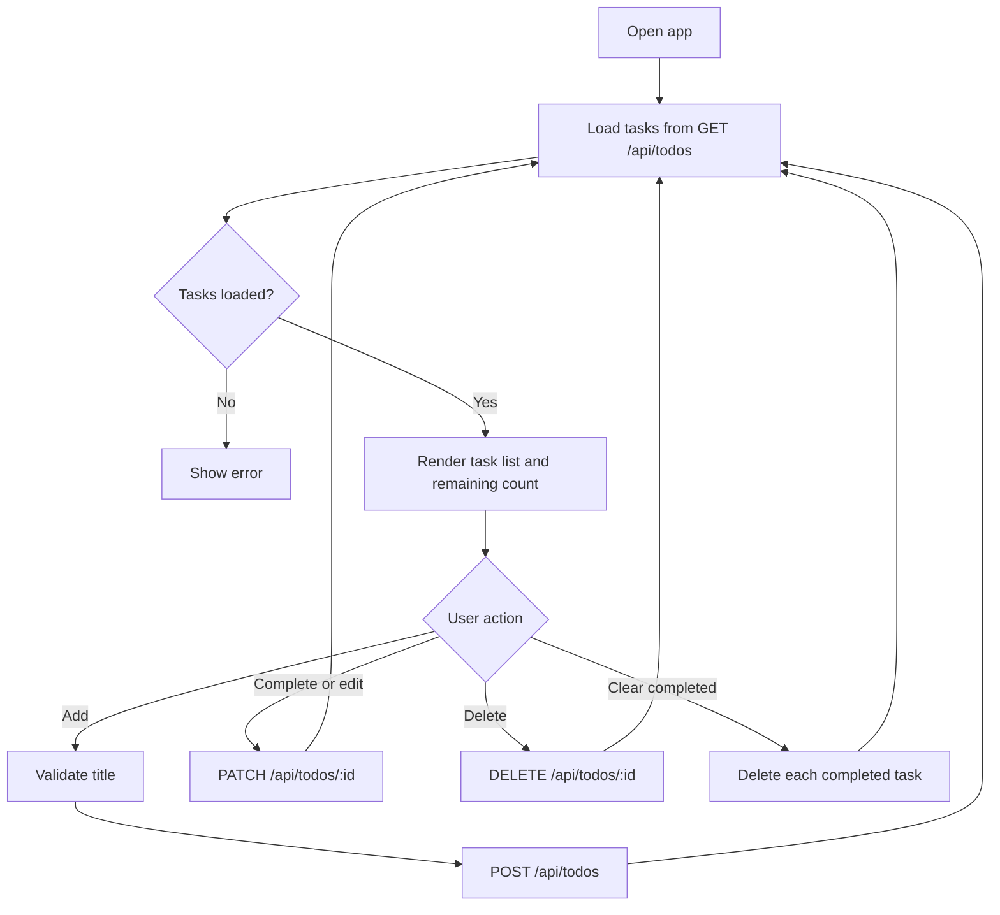

# Todo app flowgraph

```mermaid
flowchart TD
    A[Open app] --> B[Load tasks from GET /api/todos]
    B --> C{Tasks loaded?}
    C -- No --> E[Show error]
    C -- Yes --> D[Render task list and remaining count]
    D --> F{User action}
    F -- Add --> G[Validate title]
    G --> H[POST /api/todos]
    F -- Complete or edit --> I[PATCH /api/todos/:id]
    F -- Delete --> J[DELETE /api/todos/:id]
    F -- Clear completed --> K[Delete each completed task]
    H --> B
    I --> B
    J --> B
    K --> B
```
